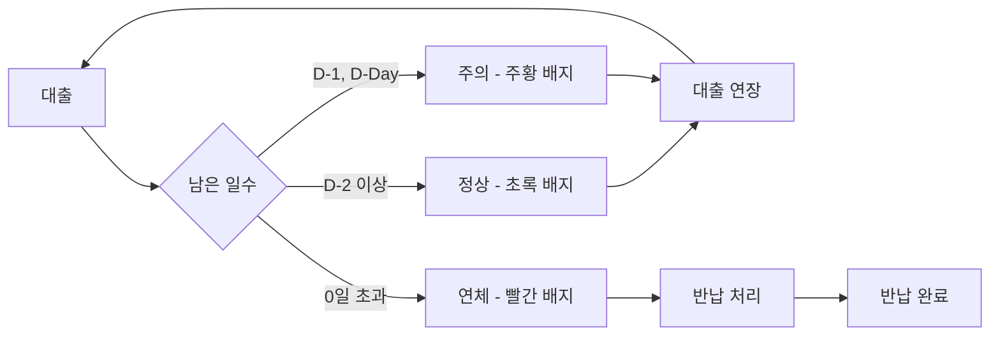

# 마이페이지 도서관 고도화 및 로고 복구 - 11

## 작업 개요

도서관 대출 위젯을 대폭 업그레이드하여 정상/주의/연체 상태를 명확히 구분하고, 각 도서별 대출 연장 및 반납 처리 버튼을 추가했습니다. "Easy to Use" 원칙에 따라 사용자가 한눈에 도서 상태를 파악하고 즉시 행동할 수 있도록 개선했습니다.

---

##  주요 변경 사항

### 1. 3단계 상태 시스템 구현

#### 상태 분류 로직
```typescript
const getStatus = () => {
  if (book.isOverdue) return 'overdue';      // 연체
  if (book.daysLeft <= 1) return 'warning';  // 주의
  return 'normal';                            // 정상
};
```

**상태 종류:**
1. **정상 (Normal)**: daysLeft > 1
2. **주의 (Warning)**: daysLeft = 0 (반납 당일) 또는 1 (D-1)
3. **연체 (Overdue)**: isOverdue = true

---

### 2. 상태별 배지 디자인

#### 정상 상태 (D-2 이상)
```tsx
<div className="px-3 py-1 bg-primary-500 text-white rounded-full">
  <span className="text-xs font-semibold">D-{book.daysLeft}</span>
</div>
```

**특징:**
- 배경: `bg-primary-500` (#a2c54e 연두색)
- 텍스트: `text-white` (흰색)
- 메시지: "D-X" (예: D-8, D-3)
- 아이콘: 없음

**예시:**
- "JavaScript 완벽 가이드" → D-8 (초록 배지)
- "클린 코드" → D-3 (초록 배지)

#### 주의 상태 (D-Day, D-1)
```tsx
<div className="flex items-center gap-1 px-3 py-1 bg-orange-500 text-white rounded-full">
  <AlertCircle className="w-4 h-4" />
  <span className="text-xs font-semibold">
    {book.daysLeft === 0 ? '반납 당일' : 'D-1'}
  </span>
</div>
```

**특징:**
- 배경: `bg-orange-500` (주황색)
- 텍스트: `text-white` (흰색)
- 아이콘: AlertCircle (경고)
- 메시지: "반납 당일" 또는 "D-1"

**예시:**
- "리팩토링" → D-1 (주황 배지)

#### 연체 상태
```tsx
{/* 배지 */}
<div className="flex items-center gap-1 px-3 py-1 bg-error text-white rounded-full">
  <AlertCircle className="w-4 h-4" />
  <span className="text-xs font-semibold">{book.overdueDays}일 연체</span>
</div>

{/* 전체 카드 스타일 */}
<div className="p-5 rounded-2xl bg-error/5 border-2 border-error/20">
  {/* 텍스트 색상 */}
  <h4 className="text-error">...</h4>
  <p className="text-error/80">...</p>
  <p className="text-error/70 font-semibold">...</p>
</div>
```

**특징:**
- 배지 배경: `bg-error` (진한 빨강)
- 배지 텍스트: `text-white`
- 아이콘: AlertCircle
- 메시지: "X일 연체"

**전체 카드 경고 스타일:**
- 카드 배경: `bg-error/5` (연한 빨강 5%)
- 카드 테두리: `border-2 border-error/20` (빨간 테두리)
- 제목: `text-error` (진한 빨강)
- 저자: `text-error/80` (빨강 80%)
- 반납일: `text-error/70 font-semibold` (빨강 70%, 굵게)

**예시:**
- "이펙티브 자바" → 1일 연체 (빨간 배지 + 전체 카드 빨강)

---

### 3. 대출 도서 데이터

```typescript
const books = [
  { 
    title: '클린 코드', 
    author: '로버트 C. 마틴', 
    dueDate: '2026-01-16', 
    daysLeft: 3,
    isOverdue: false 
  },  // 📗 정상 (D-3)
  
  { 
    title: '리팩토링', 
    author: '마틴 파울러', 
    dueDate: '2026-01-15', 
    daysLeft: 1,
    isOverdue: false 
  },  // 🟧 주의 (D-1)
  
  { 
    title: '이펙티브 자바', 
    author: '조슈아 블로크', 
    dueDate: '2026-01-12', 
    daysLeft: 0,
    isOverdue: true,
    overdueDays: 1 
  },  // 🔴 연체 (1일 연체)
  
  { 
    title: 'JavaScript 완벽 가이드', 
    author: '데이비드 플래너건', 
    dueDate: '2026-01-22', 
    daysLeft: 8,
    isOverdue: false 
  }   // 📗 정상 (D-8)
];
```

**총 대출 도서:** 4권

---

### 4. 대출 연장/반납 처리 버튼

#### 정상 & 주의 상태 버튼
```tsx
<button
  className="w-full mt-2 py-2 px-4 rounded-xl font-semibold text-sm transition
    bg-gray-200 dark:bg-gray-600 text-gray-700 dark:text-gray-300
    hover:bg-primary-100 dark:hover:bg-primary-900/30 
    hover:text-primary-700 dark:hover:text-primary-300"
>
  대출 연장
</button>
```

**특징:**
- 기본 배경: `bg-gray-200` (회색)
- Hover 배경: `bg-primary-100` (연두색 10%)
- Hover 텍스트: `text-primary-700` (연두색)
- 전체 너비: `w-full`
- Border radius: `rounded-xl`

#### 연체 상태 버튼
```tsx
<button
  className="w-full mt-2 py-2 px-4 rounded-xl font-semibold text-sm transition
    bg-error/10 text-error hover:bg-error/20"
>
  반납 처리
</button>
```

**특징:**
- 기본 배경: `bg-error/10` (빨강 10%)
- 기본 텍스트: `text-error` (빨강)
- Hover 배경: `bg-error/20` (빨강 20%)
- 버튼 텍스트: "반납 처리" (연체 도서는 연장 불가)

---

## 시각적 디자인 비교

### Before (3일 기준 단순 분류)
```
책 제목
저자: XXX
반납: YYYY-MM-DD
[3일 이하: 빨간 배지 "반납 X일 전"]
[4일 이상: 회색 배지 "X일 남음"]
```

### After (3단계 세밀한 분류)
```
정상 (D-2 이상)
┌───────────────────────┐
│ JavaScript 완벽 가이드 │
│ 저자: 데이비드 플래너건 │
│ 반납: 2026-01-22      │ [D-8] 초록
│ [대출 연장]           │
└───────────────────────┘

주의 (D-Day, D-1)
┌───────────────────────┐
│ 리팩토링              │
│ 저자: 마틴 파울러     │
│ 반납: 2026-01-15      │ ⚠️ [D-1] 주황
│ [대출 연장]           │
└───────────────────────┘

연체
┏━━━━━━━━━━━━━━━━━━━━━━━┓ ← 빨간 테두리
┃ 이펙티브 자바 (빨강)  ┃
┃ 저자: 조슈아 블로크   ┃
┃ 반납: 2026-01-12 (빨강)┃ 🔴 [1일 연체]
┃ [반납  처리]           ┃
┗━━━━━━━━━━━━━━━━━━━━━━━┛
```

---

## 사용자 경험 (UX)

### 시각적 주의 환기 단계

**Level 1: 정상 (초록)**
- 메시지: "책을 편안하게 읽으세요"
- 색상: 연두색 (#a2c54e)
- 행동: 대출 연장 가능

**Level 2: 주의 (주황)**
- 메시지: "곧 반납해야 해요!"
- 색상: 주황색 (orange-500)
- 아이콘: AlertCircle
- 행동: 대출 연장 권장

**Level 3: 연체 (빨강)**
- 메시지: "빨리 반납하세요!"
- 색상: 빨강 (error)
- 아이콘: AlertCircle
- 전체 카드 경고 스타일
- 행동: 반납 처리 필수 (연장 불가)

### Easy to Use 원칙

**한눈에 파악:**
- 배지 색상만 봐도 상태 즉시 인식
- 초록 → 안심, 주황 → 주의, 빨강 → 긴급

**즉시 행동:**
- 각 도서 아래 버튼 배치
- "대출 연장" vs "반납 처리" 명확한 액션

**명확한 정보:**
- D-X 표시로 남은 일수 직관적
- "X일 연체" 메시지로 연체 일수 명확

---

## 상태 전이 다이어그램



---

## 디자인 원칙 준수

### ✅ #a2c54e 컬러 테마
- 정상 상태 배지: `bg-primary-500` (#a2c54e)
- Hover 효과: `hover:bg-primary-100`

### ✅ 색상 의미론
- 초록 (#a2c54e): 안전, 정상
- 주황 (orange-500): 주의, 경고
- 빨강 (error): 위험, 긴급

### ✅ rounded-3xl/rounded-2xl
- 전체 섹션: `rounded-3xl`
- 개별 카드: `rounded-2xl`
- 배지: `rounded-full`
- 버튼: `rounded-xl`

### ✅ 넓은 간격
- 도서 카드 간: `space-y-4`
- 카드 내부: `p-5`
- 배지와 버튼 간: `mb-3` + `mt-2`

---

## 접근성

### 색상 대비
✅ 초록 배지: 흰 텍스트 (WCAG AA 준수)  
✅ 주황 배지: 흰 텍스트 (WCAG AA 준수)  
✅ 빨강 배지: 흰 텍스트 (WCAG AA 준수)  
✅ 연체 카드: 빨간 테두리 + 빨간 텍스트 (명확한 시각적 구분)  

### 다중 정보 제공
✅ 색상 + 아이콘 + 텍스트  
✅ 시각 장애인: 스크린 리더가 "X일 연체", "D-1" 등 읽음  
✅ 색맹: 아이콘과 텍스트로도 상태 파악 가능  

### 키보드 네비게이션
✅ Tab으로 각 버튼 이동  
✅ Enter로 버튼 활성화  

---

## 기술 구현

### 상태 결정 함수
```typescript
const getStatus = () => {
  if (book.isOverdue) return 'overdue';
  if (book.daysLeft <= 1) return 'warning';
  return 'normal';
};
```

### 동적 클래스
```tsx
<div className={`p-5 rounded-2xl transition ${
  status === 'overdue' 
    ? 'bg-error/5 border-2 border-error/20' 
    : 'bg-gray-50 dark:bg-gray-700 hover:bg-primary-50'
}`}>
```

### 조건부 렌더링
```tsx
{status === 'overdue' ? (
  <div className="bg-error text-white">X일 연체</div>
) : status === 'warning' ? (
  <div className="bg-orange-500 text-white">D-1</div>
) : (
  <div className="bg-primary-500 text-white">D-X</div>
)}
```

---

## 요약

### 변경 사항
1. ✅ 3단계 상태 시스템 (정상/주의/연체)
2. ✅ 상태별 배지 색상 (초록/주황/빨강)
3. ✅ 연체 도서 전체 카드 경고 스타일
4. ✅ 대출 연장/반납 처리 버튼
5. ✅ 도서 4권으로 증가 (다양한 상태 표현)

### 디자인 원칙
- **Easy to Use**: 한눈에 상태 파악, 즉시 행동
- **시각적 주의**: 색상 + 아이콘 + 메시지
- **명확한 정보**: D-X, X일 연체

### 파일 수정
**수정:**
- `src/pages/MyPage.tsx` (도서관 대출 위젯 고도화)

---

**작성**: 2026-01-13  
**다음 작업**: 공지사항 상세 페이지 및 필터 기능 - 12
